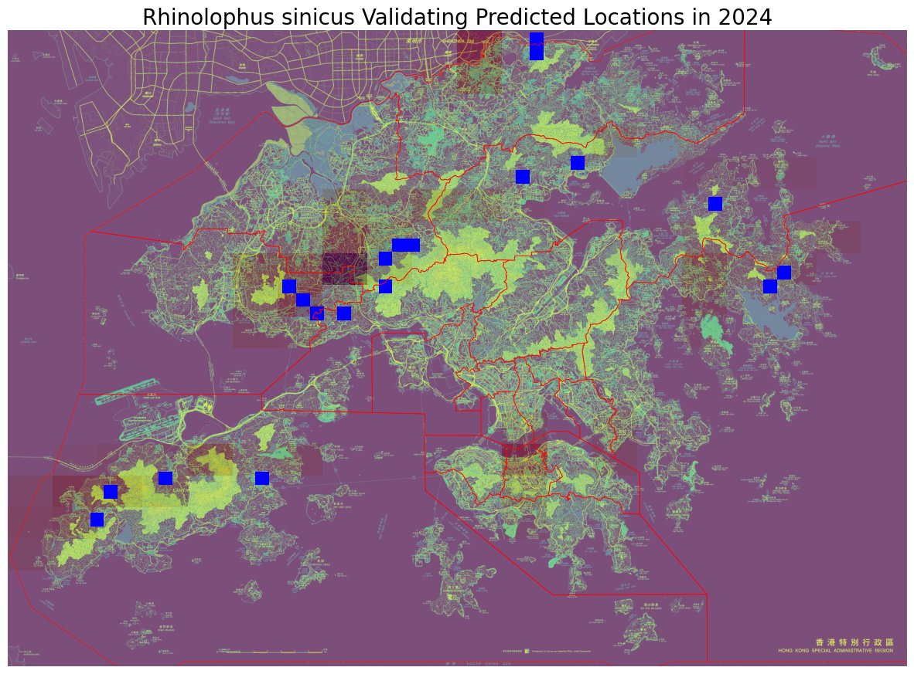

# Hong Kong Species Prediction API
Interactive web application through **AWS Lightsail** for exploring Hong Kong's biodiversity with 2025 species occurrence predictions estimated by a Convolutional Neural Network with Long Short-Term Memory (CNN-LSTM) `deep learning` model.

## File Structure
hkspecies/
├── boundaries/                 # Hongkong boundaries in shapefile
├── predictions_cache/          # Precomputed predictions for each species in Hongkong
├── processed/                  # Processed geospatial data including districts and species occurrences from all available years
├── species/                    # Raw datasets obtained from [Esri](https://opendata.esrichina.hk/maps/esrihk::occurrence-data-of-hong-kong-species/about)
├── app.py                      # FastAPI server script by Amazon Q Developer
├── data_processor.py           # Initial data processing pipeline
├── frontend.html               # Frontend UI by Amazon Q Developer
├── hk.tif                      # A raster file for Hongkong map display
├── precompute_predictions.py   # Generate precomputed predictions
├── README.md                   # This file
├── requirements.txt            # Required Python libraries
├── species_inference.py        # Predictive modelling functions
├── species_lookup.ipynb        # Data exploration
├── species_model.ipynb         # EDA and predictive modelling
│  
└── README.md                   # This file

## Features
- **Species Search & Exploration** - Browse 1000+ Hong Kong species
- **Interactive Maps** - Visualise species occurrences with `Leaflet` maps
- **AI Predictions** - `CNN-LSTM` predictions for 2025 species locations
- **Real-time Data** - Species occurrence data from 2001-2024
- **Responsive Design** - Works on desktop and mobile devices

## Production Deployment (AWS Lightsail)
- AWS CLI configured
- AWS Lightsail access

## Data Preprocessing
- The Hongkong map was divided into 20x20 grids for simplification.
- The *target* variable (location) was the grid ID.
- Each species has its own array with shape, (24, 20, 20), storing number of occurrences in each year.

## AI Prediction Model
- **CNN-LSTM** ([ndrplz](https://github.com/ndrplz/ConvLSTM_pytorch))
- **Training**: Adam optimizer, BCE loss, 100 epochs with early stopping.
- Output example:

## 🎯 Use Cases
1. **Research & Education** - Explore Hong Kong biodiversity
2. **Conservation Planning** - Predict future species distributions
3. **Environmental Monitoring** - Track species occurrence trends
4. **Public Engagement** - Interactive species exploration